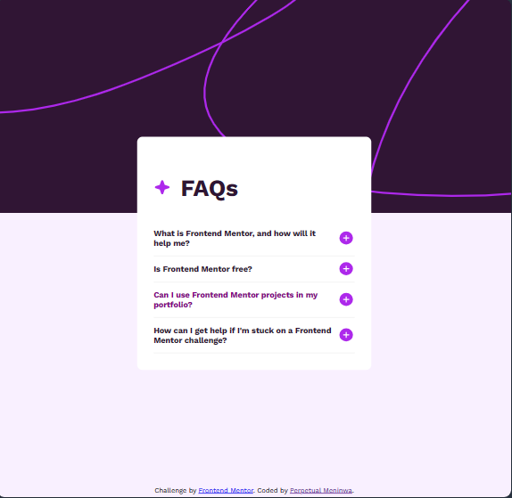

# Frontend Mentor - FAQ accordion solution

This is a solution to the [FAQ accordion challenge on Frontend Mentor](https://www.frontendmentor.io/challenges/faq-accordion-wyfFdeBwBz). Frontend Mentor challenges help you improve your coding skills by building realistic projects. 

## Table of contents

- [Overview](#overview)
  - [The challenge](#the-challenge)
  - [Screenshot](#screenshot)
  - [Links](#links)
- [My process](#my-process)
  - [Built with](#built-with)
  - [What I learned](#what-i-learned)
  - [Continued development](#continued-development)
  - [Useful resources](#useful-resources)
- [Author](#author)
- [Acknowledgments](#acknowledgments)

## Overview

### The challenge

Users should be able to:

- Hide/Show the answer to a question when the question is clicked
- Navigate the questions and hide/show answers using keyboard navigation alone
- View the optimal layout for the interface depending on their device's screen size
- See hover and focus states for all interactive elements on the page

### Screenshot

### Links

- Solution URL: [Add solution URL here](https://github.com/FrontendMentor-Perpydel/FAQ-accordion)
- Live Site URL: [Add live site URL here](https://your-live-site-url.com)

## My process

### Built with

- Semantic HTML5 markup
- CSS custom properties
- Flexbox
- Mobile-first workflow
- Vanilla JavaScript
- [SASS](https://sass-lang.com/guide/) - For styles

### What I learned

I was able to directly implement using SASS, using this simple FAQ accordion. I was able to make use of the modules and inheritance/extends the functionality of SASS, also the nested structure made it easy to implement CSS.

### Continued development

I am also working on the accessibility of this project in the aspect of adding keyboard navigation to the project.

### Useful resources

- [SASS](https://sass-lang.com/guide/) - This helped me with figuring out how SASS works and how to configure it to be converted to Vanilla CSS so that it can be integrated into the HTML code.

## Author

- Website - [Perpetual Meninwa](https://pm-portfolio-drab.vercel.app/)
- Frontend Mentor - [@Perpy-del](https://www.frontendmentor.io/profile/Perpy-del)
- Twitter - [@pominspirational](https://twitter.com/pominpirational)

Thank you for reading!
